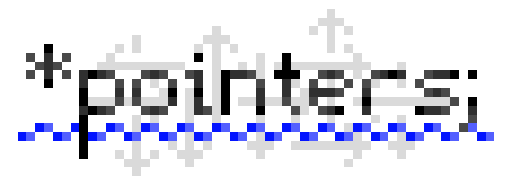

# 

## At the moment, I am no longer working on this project.

*Pointers is a mod about things that point to other things.*
While it is still in early development, it has the following features (subject to change without this list updating):
- Inventory Pointer (WIP)
    - Allows an inventory (Single side of a TileEntity with item handler capability) to be accessed similarly to how a hopper or pipe would access said inventory.
- Mechanical Pointer
    - Right-clicks a block from a remote location (calls onBlockActivated, not unlike OpenBlocks cursor).
- Redstone Pointer (& Redstone Receiver)
    - Toggles the signal output of a Redstone Receiver between 15 or 0.
- Positional Pointer
    - Teleports the player to set coordinates in a set dimension (regardless of safety).

Feel free to request features and submit bug reports with the "Issues" tab.
This is the first mod I plan on releasing, so code criticism is welcome as I don't know very much about Forge and its best practices.
